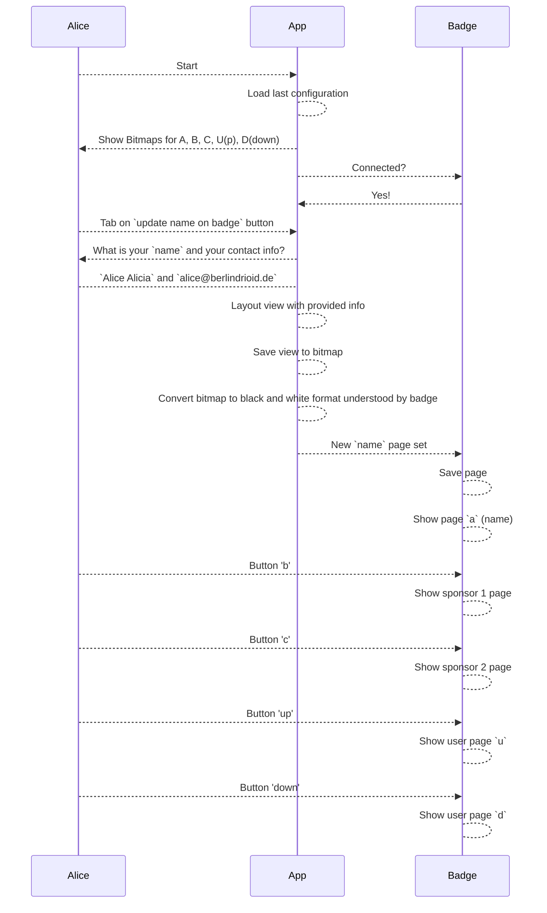

# ZeBadge
Droidcon 2023: The time a new badge saw the light of the day, full with delight and android programming capabillities.

This is the badge: 

And this is the Android app:
* [release 50](https://github.com/gdg-berlin-android/ZeBadge/releases/download/50/ze-badge.apk)

> __TBD__

Together they make magic happen. 🪄🦄

# Droidcon contribution guide: 
1. Fork the repo & make write your code
2. Use "droidcon/${name}" format for the branch name so we can find it.
3. When done, open a PR and come to the booth to get you badge.

# Getting Started

The following sections are describing the badge in detail, but if you just want to get started, please feel free to follow our [Getting Started](./zehardware/README.md) guide.

# Scenario
The following lines are the thought experiment on how we imagine a visit to the GDG Berlin Android Droidcon 2023 Berlin booth will look like. Allice is an atenndee and Olivia is an organizer.

| Actor | Dialog |
|-------|--------|
| Alice | Hey, I saw that thing everyone is running arround, that with their name on it? They said I can find it here, is that true?|
| Olivia | Yes, you came to the right place, this is _ZeBadge_, a digital badge that displays your name and can be programmed and changed!|
| Alice | Oh that is amazing, how does this work? How can I get one?|
| Olivia | You need to do what we all love to do: Write some code and create a PR on our open source repository, controlling the badge and the android app. You can get started with using one of our loaner badges, and read one of our getting started guides. Once you have done "something code" with it, you can get your own badge.|
| Alice | Oh, neat, that is this qr code to get started _points to one of the printed out sheets_?|
| Olivia | Indeed, take loaner number four and happy hacking! Feel free to reach out when we can do something for you.|
|| _Alice went over to the loaners, played for 20 minutes with the badge, and was able to follow the getting started guide and create a new page system, showing the weather on page 2. She pushed a PR._ |

# Graph

The following diagram shows which parts are involved in this badge:

