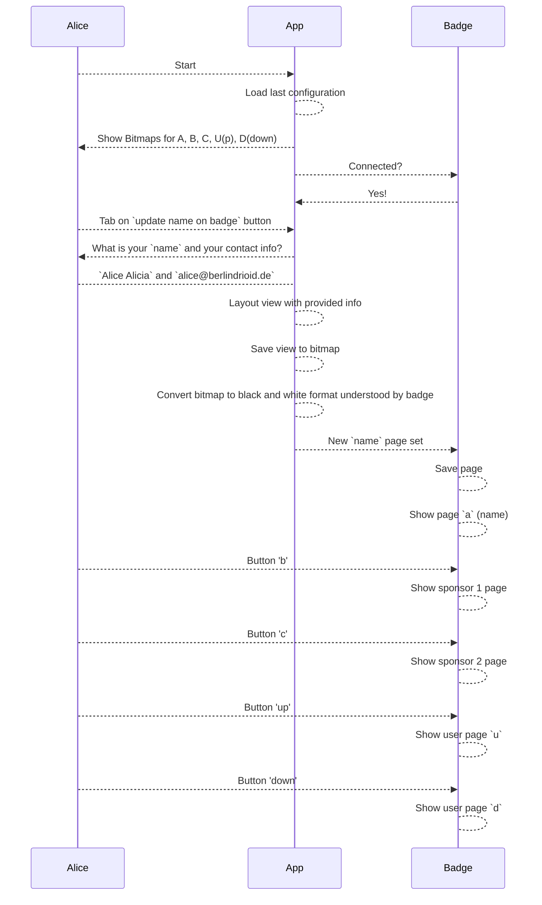

[](https://github.com/gdg-berlin-android/ZeBadge/actions/workflows/main.yml)

# ZeBadge


Droidcon 2023: The time a new badge saw the light of the day, full with delight and android programming capabilities.

Droidcon 2024: Same amazing badge but with better software, extension modules and a splash of AI.


# ZeApp
App for configuring static images on your badge from your Android phone. Connect ZeBadge to the phone with a USB cable, select an card to display and hit "Send". Super easy, barely an inconvenience.

You can build ZeApp locally or download the latest build from:

1. (Coming soon, see [#58](https://github.com/gdg-berlin-android/ZeBadge/issues/58)) [Firebase App Distribution](https://appdistribution.firebase.dev/i/6373ffacb6e72c23)
2. [GitHub Release Page](https://github.com/gdg-berlin-android/ZeBadge/releases)

# WebApp

Go to [ZeOffizialWebSeite](https://zebadge.app) If you have a compatiable browser (chrome, edge), great. If not, not so great.

You will see a website with a badge and several text boxes. Please put words and numbers into the boxes and check what happens. Once you are content with the results, attach ZeBadge, press the "sent to badge"-button and observe the magic of a flashing light. After a few seconds the new image is flashed and you can show it off.

This magic happens through WebSerial, a ktor backend, the dithering algorithm from Kotlin and some custom crafted js frontend. Fjoi.

## Building WebApp

Build server and pack into one archived jar
> ./gradlew server:fatJar

copy jar to server
> scp zeapp/server/build/libs/server-1.0-SNAPSHOT-standalone.jar myamazingserver:

log into server
> ssh myamazingserver

execute jar (jolo)
> sudo java -jar *jar 80

The last step started the remote webserver on port 80, with root rights. 🤓

## Building the WebApp with Docker 

Just run the following docker commands to build and run the server. 
```bash 
docker build -t ze-server -f ./zeapp/Dockerfile ./zeapp
docker run -p 8080:1337 ze-server:latest
```

Open the http://localhost:8080/ should display "yes" in the browser.


# Droidcon 2024 contribution guide: 

If you don't have a badge:

0. Fork the repo & make write your code.
1. Use "droidcon/${name}" format for the branch name so we can find it.
2. When done, open a PR and come to the booth to get you badge.
3. Open a new PR with some more changes and get one of the extension boards (WiFi module or a keyboard)

If you already have a badge from Droidcon 2023:

0. Visit GDG booth to get you badge flashed with the newest firmware.
3. Open a new PR with some more changes and get one of the extension boards (WiFi module or a keyboard)

# Getting Started

The following sections are describing the badge in detail, but if you just want to get started, please feel free to follow our [Getting Started](./zehardware/README.md) guide.

# Graph

The following diagram shows which parts are involved in this badge:


