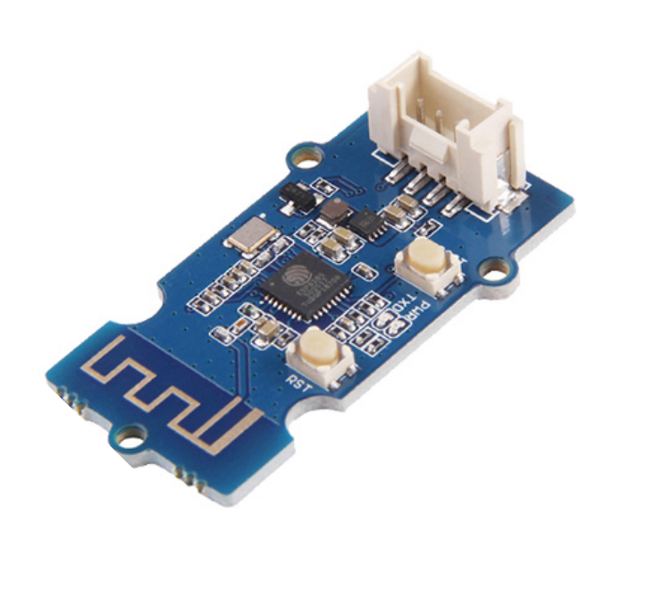
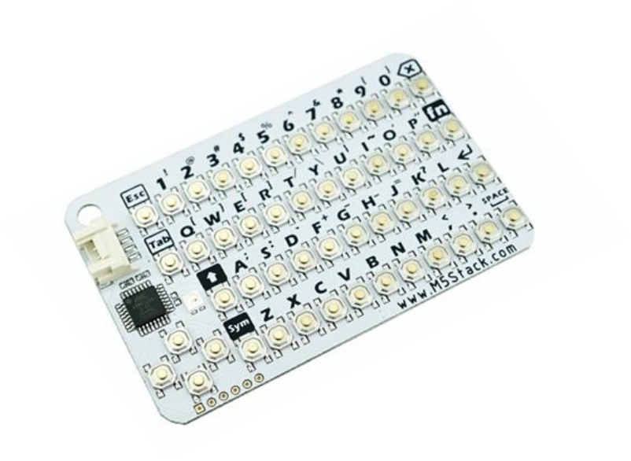

# ZeBadge Hardware

<center style="background:lightgrey;border:4px outset white">

</center>

## What is it?

It's a simple circuit board hardware badge with an integrated e-ink display. See the root [README](../README.md) for
more info.

⚠️ Looking for commands? Jump to [Serial Command List](#serial-commands) directly.

## How do I set up the badge?

If you got your device from us, it's already set up with ZePython, our fork
of [CircuitPython](https://circuitpython.org/), some libraries and some applications.

# User Interface

<center style="background:lightgrey;border:4px outset white">


</center>

How do I use it? Usually by pressing buttons: ZeBadge comes with 5 front facing buttons: The application
buttons `a`, `b`, `c` to select
an application to be run and `up` and `down` buttons as input for the actual app.

Additionally, it contains two system buttons on the back: the `rst` (reset) and `usr`(user) buttons: `reset` resets
ZeBadge and `usr` show the
terminal output. Different combinations of buttons can be used during boot.

## Built In Apps

Every ZeBadge comes with three apps, accessible through the front facing `a`, `b`, or `c` app buttons. Every ZeBadge
contains
the same `a` app: A display of pages uploaded to it.

### Pages App

Pressing the `a` button reveals the page app that displays the currently available pages on ZeBadge. Those pages are
uploaded
through the [store serial command](store-command). A press of the `up` or `down` front facing buttons reveals the
previous or next page, alphabetically
sorted by file name. Reaching the last (or the first) page and pressing the next button will wrap around and start over
again:
Wanting to see the next page while being on the last page stored, will result in showing the first page.

### The B and C Apps

Apps presented to the user on ZeBadge depend on the accessory (ZeAccessory) attached to it: [ZeBattery](#ZeBattery) is
the base requirement, whereas [ZeKeyboard](#ZeKeyboard)  and [ZeWifi](#ZeWifi) accessories will present different apps
to the user. The following table illustrate the available apps

| Accessory                 | A App               | B App                     | C App                           |
|---------------------------|---------------------|---------------------------|---------------------------------|
| [ZeBattery](#ZeBattery)   | [Pages](#pages-App) | [Shopping](#shopping-app) | [ZeEFLap](#ze-eflap-app)        |
| [ZeKeyboard](#ZeKeyboard) | [Pages](#pages-App) | [Notes](#notes-app)       | [ZeAdventure](#zeadventure-app) |
| [ZeWifi](#ZeWifi)         | [Pages](#pages-App) | [Schedule](#schedule-app) | [ZeChat](#zechat-app)           |

#### Shopping App

<tt>status: todo</tt>
<tt>ADD IMAGE</tt>

Write down you shopping items to be shopped for

#### Ze EFLap App

<tt>status: todo</tt>
<tt>ADD IMAGE</tt>

Play flapping Ze's with a framerate of 0.4.

#### Notes App

<tt>status: todo</tt>
<tt>ADD IMAGE</tt>

Take notes, while listening to the talks.

#### ZeAdventure App

<tt>status: todo</tt>
<tt>ADD IMAGE</tt>

A text adventure!

#### Schedule App

<tt>status: todo</tt>
<tt>ADD IMAGE</tt>

Display your current [favorite android conference](https://berlin.droidcon.com) schedule.

#### ZeChat App

<tt>status: todo</tt>
<tt>ADD IMAGE</tt>

Send a lot of Ups and Downs to your fellow ZeBadge owners!

# Accessories

This year (2024!) is very special to us. If you want to find out why, come to our booth and talk to us.

To celebrate, we are offering free accessories to your PRs:

1. ZeBadge + ZeBattery
2. Either ZeWifi or ZeKeyboard

Luckily ZeBadge comes with enough plugs for everything: A battery plug, a stemmaQT expansion plug and finally: Usb-C.

<center style="background:lightgrey;border:4px outset white">                                             
</center>

## ZeBadge

<center style="background:lightgrey;border:4px outset white">

</center>

This is ZeBadge. See https://github.com/gdg-berlin-android/zebadge for all information and recursion.

## ZeBattery

<center style="background:lightgrey;border:4px outset white">

</center>

It is a battery pack of two AAA batteries. Power on the device while only battery powered, by holding down the `up`
button. Keep holding it, till "the rhythm of blinking changes". Mario should really add a video about it here.

## ZeWifi

<center style="background:lightgrey;border:4px outset white">

</center>

Need Wi-Fi? No worries, this module will add it in some form to the badge. Disclaimer: No DNS, no TLS, only IP. For
configuration use.

## ZeKeyboard

<center style="background:lightgrey;border:4px outset white">

</center>

Type away with this handy accessory: Capable of lower case AND upper case, this accessory leaves nothing to be desired.

# Internals

The following lines are thought of a resource for digging deeper: Want to know what shenanigans makes this badge work?

## Booting

If ZeBadge is powered up, either by a USB-C connection or ZeBattery, pressing specific buttons at boot time will result
in different modes:

| Button Pressed | Effect         | Description                                                                                                                                                                                                                                       |
|----------------|----------------|---------------------------------------------------------------------------------------------------------------------------------------------------------------------------------------------------------------------------------------------------|
| Reset          | boot loop      | Holding this stops ZeBadge from starting, great for getting ready to press other buttons                                                                                                                                                          |
| User           | flashing       | Once you let go of reset, but keep holding onto the user button on the back, ZeBadge will be in 'flashing' mode: A new drive "RPI" appears and is ready to receive a new version of `ZePython` or `CircuitPython` or any other firmware.          |
| A              | developer mode | The developer mode allows you to upload new python files to the `CIRCUITPYTHON` drive that appears uppon booting. Serial commands like `storing` will fail: ZeBadge cannot write to the storage in this mode, only the connected computer / phone |
| C              | Safe Mode      | Sometimes you need to delay the booting of [ZeOs](#ZeOs). This is where this mode comes in handy: It stops the execution of ZeOs and loops till you were able to connect a serial console to it. Ideally used together with 'a'.                  |                |                |                                                                                                                                                                                                                                                   |

## ZeOs

We(?) decided to amp up our game and completely rewrite the software powering ZeBadge, aptly named ZeOs. It felt more
complicated
than a simple app, so it needed to be an os. It is build using [ZePython](#zepython).

ZeOs contains some system functionalities like [ZeBus](#zebus) and allows communication to the outside world
thought [ZeSerial](#serial-commands).

### ZeBus

A central point for the software: Every _module_ or _app_ communicates to each other by putting messages on this bus or
reacting on messages they have subscribed to. This is so that different accessories can be used without needing to
change
fundamentals of the os. We only need to register different subscribers that send different messages based on their
purpose.

Also apps are implemented this way: All apps should listen to the press of the `up` and `down` buttons, but also other
messages they need for their working: To communicate to `Wi-Fi` or `Keyboard` modules, apps need to send their specific
messages (`CONNECT TO WIFI`) and subscribe to specific topics (`Was key l pressed`).

### Configuration

As a special feature of ZeOs, configuration options are saved in a file called `ze.conf`. Here you'll find all settings
for all apps and all modules. Think of the wifi IPs, ssids, usernames, last messages, favorite shopping item.
Use [serial commands](#serial-commands) to fetch and manipulate it or read and write
directly to it, depending on the [mode](#booting) zebadge was booted into.

## ZePython

Sadly we had to fork [circuitpython](https://circuitpython.org), due to the epaper hanging randomly.
See https://github.com/gdg-berlin-android/zepython for the current status.

We are planing to retire this fork, as soon as the fixes are mainlined. In the meantime, enjoy
calling `board.DISPLAY.is_zebadge()`
on our fork, just to prove it can be done.

## Flashing the device yourself

Under normal circumstances, you never have to flash the OS, we did it already when you got the badge. If you happen to
want to follow our developement approach with your own badger 2040, we'd love to hear from you. Here are our steps:

1. Press and hold the `boot` hardware button on the back on the device, alternatively press the reset button and keep
   holding the `boot` button.
1. While holding the button, plug the device into your PC, or let go of the `reset` button
1. You should see a new drive attached to your PC called `RPI-RP2`
2. Let go of all buttons
1. copy a `.uf2` binary (or [zepython.uf2](zefirmware/zepython.uf2)) onto the root folder `/` of the device. Once
   complete, the device will
   automatically restart and install the firmware

On very stubborn errors, use [flash_nuke.uf2](zefirmware%2Fflash_nuke.uf2) like so:

1. Repeat the upper steps till the uf2
2. instead of your chosen firmware, first nuke the drive with [flash_nuke.uf2](zefirmware%2Fflash_nuke.uf2)
3. and then try your firmware of choice
4. You now have removed all custom changes of the firmware and software
4. Your device should now appear as a new drive on your PC, containing some Python and configuration files.

Once the firmware is running, you need to copy all python files from the `/src` folder of this repo to the root of the
Circuitpython drive.

### Flashing other/custom images

If you don't want to flash a base OS image we use and describe in the section above, you can take a look at other
examples of custom images: [rpi/pico-examples](https://github.com/pimoroni/pimoroni-pico/tree/main/examples). You can
also take a look at the
source [here](https://github.com/pimoroni/pimoroni-pico/blob/main/examples/badger2040/badger2040_image.cpp).

To find some examples of Pico images you could flash, see the compiled
binaries [here](/zehardware/experiments/c++/flash) and the experimental
images [here](/zehardware/experiments/c++/images). For some of our testing purposes, we used the `badger2040_image`
binary.

##### How do I build custom images?

1. Install the [C++ SDK](https://github.com/pimoroni/pimoroni-pico/blob/main/setting-up-the-pico-sdk.md) from Pimoroni
1. Build using C, following that guide
1. After the project is built, under the `build` directory we will have all the examples (their flash files)
1. Reminder: for testing purposes, flash your device with "badger2040_image"

One important side-note, the build (`cmake` & `make`) took around 30 minutes total.

### Writing and running code

You might want to reconfigure or rewrite the badge's code to your liking. The device normally runs a micro-version of
Python, with most (_but not all!_) default Python APIs built-in.
With our ZeOS and ZePython, all files are in the root directory on your device:

- `boot.py` is executed only once, on device boot
- `boot_out.txt` contains any message that arise from booting the devices
- `code.py` is the main dish – it starts ZeOs and runs the `a` app.
- Additional libraries are in `/lib` on the device. Our repository
  contains **all** Adafruit libs, but you should not copy the stuff you don't need to the device

The devices we give out are already configured with the required libraries and do not need additional libraries to run
our code.

If you want to program your own app, ZeBodemann recommends to use PyCharm to build the code first, ignoring all
CircuitPython
dependency errors, having a shell open that runs `screen /dev/cu.usbmodem2101` (mac) or `screen /dev/ttyACM3` (linux) or
`scream C:\\COMPORT:SHENANIGANS` (windows). And for the additional resource hungry add an Android Studio to it, so ZeApp
can be run on the phone wireless, while the phone itself is connected to the badge using a serial app to check what
ZeBadge
is reporting.

Alternatively you can follow ZeMilos and use [Thony]().

## What can I do with the device?

_This section assumes you didn't edit the device code after receiving it from us._

The device is set up to receive and respond to a simple set of commands through its main serial port (better known as
the USB), as well as react to commands given by the on-device hardware buttons. (From [boot modes](#booting), the
developer mode
actually opens a second serial device, that opens a python REPL to execute code dynamically. Allways look for "the last"
serial
device opened from the badge)

Some of the commands run on the device and don't produce visible results, while others are set up to do graphics
rendering and communication with other on-device hardware (like the LED light, or other accessories).

### Command structure and format

Commands are sent through the serial port to the device. The send commands must be known to the device, so
adding new commands requires a code change on the device and the android app.

Each command **must** have all 3 components, in this order:

|        **Name**                  	        |        **Metadata**                                                           	        |            **Payload**                      	            |
|:-----------------------------------------:|:--------------------------------------------------------------------------------------:|:--------------------------------------------------------:|
| A simple name of the command, e.g. `help` | Additional data for the command, not required for the command to run; e.g. filenames 	 | The main command data, required for the command to run 	 |

Rules:

- Only the **command name** is mandatory, the rest of the components are optional
- Optional components still must be sent, at least as empty strings
- The delimiter used to separate the components is a simple **colon** (`:`)
- A final, production-ready command must be Base64-encoded
-

### Examples

All commands available are [listed](#serial-commands) below. Following is a simple example for illustration.

#### Help Command

```console
help::/r/n
```

Response

```
config_listn,show,store,preview,reload,list,delete,exit,help,terminal,config_load,config_update,refresh,config_save
```

#### Sending an image preview command, with no metadata and pixel payload:

```console
preview::eNpjYKAuSCBGkQPDKKAeYCFGETNNrG6glkEcQzTsG4ZzmhkOWYKYCGKk1DoBItQ4EuMSZ7hJHbgVscFZc3ArSoOzLHArcmdgIugkVjZEEWJAOMCZORxwhT3CLuaKA9gqBFTHsFc0YAtlUEnBogCzhF+BAaslQFUs8KqIrYKI+oqxgIjcodyAI++r9GDzJxAguY/tBOF6z4CoqlWAskRJanpXoEthI0CM49ionCuJAkSFFxMxoeSgQJXgciDOECaquJm4IBq0FaEA8QGYQC1PENUI9iNGEVHpXXyAgxi98aZBRKLmwJLBiGkEcuDI1YwPkDgTcMY50wGiMpkA2BZ2ahRrw7ylNQpG430U0AkwDajtCrQwFADBFRX4/r/n
```

The payload here is in Base64 format, so it can be transmitted over serial. Additionally, the image data stored in the
base64
encoded string is a zipped representation: Every bit of the resulting binary data contains a black or white pixel.

If we split that last command by a colon (`:`), we get the following:

- name: `preview`,
- metadata: `{empty, ignored}`,
- payload: `eNpjYKAuSCBG...`,

In general, each command must define what data it needs to run. This is reflected by the on-device code.

If you want to generate a command like this, feel free to check out our other apps, the terminal app, the android app,
or similar, they all are taught to be using this protocol.

## Serial Commands

⚠️ &nbsp; Important consideration: each command, button press or screen refresh has some debouncing to preserve a steady
command stream.

This means that you may experience delays of up to 5 seconds on your commands – this is by design.

### General

#### Help 🧐

Returns all serial commands registered

| Command section | Content |
|-----------------|---------|
| Name            | `help`  |
| Metadata        | N/A     |
| Payload         | N/A     |

Please read from the serial console once this command is issued.

Example:

```console
help::
```

### Debugging

#### 🖥️ &nbsp; Reload

Reloads the latest badge code changes.

| Command section | Content  |
|-----------------|----------|
| Name            | `reload` |
| Metadata        | N/A      |
| Payload         | N/A      |

Should rarely be used, the changes are applied automatically

Example:

```console
reload::
```

#### 🖥️ &nbsp; Terminal

Shows the Terminal on the E-Ink display.

| Command section | Content    |
|-----------------|------------|
| Name            | `terminal` |
| Metadata        | N/A        |
| Payload         | N/A        |

Example:

```console
terminal::
```

#### 🖥️ &nbsp; Exit

Stops the main loop and exits to an interactive Python interpreter (REPL).

| Command section | Content |
|-----------------|---------|
| Name            | `exit`  |
| Metadata        | N/A     |
| Payload         | N/A     |

Example:

```console
exit::
```

### Interactions

#### 🖥️ &nbsp; Preview image

Previews an image on the E-Ink display. The image is not stored.

| Command section | Content                                                 |
|-----------------|---------------------------------------------------------|
| Name            | `preview`                                               |
| Metadata        | N/A                                                     |
| Payload         | Base64-encoded, zipped, binary image format (see below) |

The binary format here is critically important, as it applies to all other image-related commands as well.  
Due to hardware limitations, we have to minimize the amount of data we send to the badge, but also minimize the amount
of memory we allocate for each bitmap render.

The general idea of how we transmit images is this:

1. Make the image black and white first (you can do that using our apps and tools)
1. Binarize the image: turn the bitmap pixel matrix into a simple binary array:
    - Create a new byte array; this will contain the result
    - Looping through rows and columns of the bitmap, inspect all image pixels one by one
    - If the pixel is white (`b255`), push a binary `1` into the result array
    - If the pixel is black (`b0`), push a binary `0` into the result array
1. The binary array is grouped into bytes by the default behavior of arrays in most languages
1. Compress that byte array using the `zlib` compression lib
1. Encode the compressed byte array into a byte array
1. Base64-encode that array for use as `payload` of the command

To assist you in preparing the images, use our [command line, desktop, or android app](../zeapp) from this repository.

example:

```console
preview::eJy12F9MG3UcAPDvtef16q5wdTquKbPXQpgPaFq6MCbRnWwhI2Ga+GCM+OcGhGCCpIsJLBmO60IaSbpQ5GUVl+3RF5NFzeBl5gBlI06HPjHZYiNkmsgiaCAlAvXau/vdUXr87sVfSO9+5ZPf99v7+/v+AOy0wRyu7QCBNbmc5JKwsYhMmY2MYpU2UANnA3Hh0t+7TGkDY4EaTBkBI5ZGsrHLAFUaOXftWyDKtE9IFojeFdoC7TowvAXizZ2wHcRaIMHcoS2QbO4wFkgyd8jSiNjVc/zfyKHSHjU1QkGcnN9R+yCa0BM1nUVIG4M3Ic9XdQj5UhJV5qGgMVjLQC3Tx+nI//BTWUfPvCl5/H4/HAjW10Hf0UPVOqrvX0kh1CL5vKOjwASjPIRCXJeO+m9NdOro0Byw7OhhoKuClRDqZS/qaO6LxdM6euoMsN5RL9CRqjJoF1lBR8nFnl90xH4HnNebAjoackCIZ0VWQ+3Nj79EiIJC4lxFVR2E6sM1nIoIR3isVtJRMyiHoAye9eVzqhzg9JHYS2/c4TUEZOnT4pDh1Ot6OOXuK4mczwPxNEJ7m4omuqFawCBqvkbt7YdcGfIOHoGPxyJqcNwGyv0+NY9FCWqqFYcIyZ/AhiOFkabC5bzvSNyt2cL9sR+Cmi7PWgyHiIPDI2ENBYrfN6sqCkMLtaKHI4NkkG5ihwofvPKtdj3VCO7mzgwmXJQFZxR3CI7OQTyNQ0d6eDjFYlBj/cf57PdH9X9/i0fHfn1F7e2HDn5Eqg9YA5F7UMXXO5mikcqIYkRu/Tt5mt+FGFemCDnbBAcr6SiQK4QWi9FblVI8hUFwM7e0JOqIg9Lo8p/vUzJCc1L55ACIgXi2d2mgXNaR+zrjQjn5stLhFQbE41PJ/nM/5t/vKgrFwgEGobRE31VQbIbsiCY4XkfwKjuIjpPfrSAKRHFGCkUTDMqJdMbXEfJxEpcfSTy72hFxlktoJNb1GbpUfFfVcKI40BGhnBmEgPneGCmnIFJBMhOKUiAaKFSFEOeAQriwzLRHnQYSAKoNpLyw75ZB5vhMsiOSqERI0t5d6mnZUtDg7S3lYHZEqXKUk6wFVVG2MDchSfXxgA6B7DChvU397yol4NGmJ4xHDz1JPNp4N4NHf7XF8OjxtXk8uvDBAh59+N4fePTS4g088oxnEbJ6ZgL12jZC7upPWkx/XlrQkOPBOj4c4f8Gj6BlQsIjZt0Gcrwj4BG02EFPhm2gUMoGUhsOVdtBppH0ebxQhAgTIgrpKcWDoN+QJRAaCYXWw/2MUEU4lcm8IC7ffLu54dLt+LA7i9AcQoFsevNG4+bWo53Wi7P35DQzidDKdR1xyXEfGxlOzk6fnz21IKzRYYQ2jNnh5TF3JuImE03np1uvwFlaROgCmmd6h8boWPAAk5junu5eEM4xsoEeyfpIQ+M+LuhOJqZbZxsW5J+uSAi9vJ1C4dJr/0SGtxInmwca7l1Nbxq/7sR9Ho2UEk8G6U6pqYkDp5v+4XNjpLZJ5dO599wRnDHPD+ysQMlCgsgaFUOgv6s0yp8cIqOhE+PKJ2VRJqn3N5TnNiXLMgkeaGhjW7IuuPrVjevajmhdujWqmVNnFiXrIrBOLmycy70L1uVkJV/YOI6NPKf8XAvk0bbx9WXrEld7YShlSp/rvlWx7FQTB0cyTRwByqLK/02bBXXliC3LpYAXjd2YJdq9qGBrecLWQoetJRNbiy+2lnFsLQjZav8BwW4yIQ==
```

#### 🖥️ &nbsp; Refresh

Requests a refresh to happen on the next refresh cycle.

| Command section | Content   |
|-----------------|-----------|
| Name            | `refresh` |
| Metadata        | N/A       |
| Payload         | N/A       |

Example:

```console
refresh::
```

#### 🖥️ &nbsp; Show

Shows a stored image file.

| Command section | Content    |
|-----------------|------------|
| Name            | `show`     |
| Metadata        | {filename} |
| Payload         | N/A        |

This shows only previously stored images. Use [store](#--store) to upload an image. The extension `.b64` is
automatically added if not found.

Example:

```console
show:milos-exposed.b64:
```

#### 🖥️ &nbsp; Store

Shows a stored image file.

| Command section | Content         |
|-----------------|-----------------|
| Name            | `store`         |
| Metadata        | {filename}      |
| Payload         | {image payload} |

This stores an images, given the usual format. Use [list](#--list) for a list of already stored images, overwrites. The
extension `.b64` is automatically added if not found.

Example:

```console
store:milos-exposed.b64:eNrNWG9sE+cZf++Sw8aB2kS2UnWADUq09NYSvrRU64LPgWhgVOnm+gUKa5JN2ocxhfBhRRWU+PJPhKBpFCWd1C91Unu1XwgJU+NJicglMIQ27UPakXbDBbtsH9JAcFIljuVz7tl7Z8IS5gv9NO2V4vf+/Px7fu/ved7nzkHo/3tYVp/yBUEOadUpKcwkrDxjI4VBgyvP1gsFQeyqAJZgQRDjR0h8jJeQozATwtLykvqNdNNFX0A9ehAGCww2APUIqFxf00aMOL+Rm58iB6ZSmGNEMNCNEIfRD72UykJCEr8GaEe43BLhyUWBGIEQib2cJRMciUS3G+lGDE/K+nE5T8IVHr9khMK4JBAihFzs7vAZYRwYi1jtwb79osPIASoc+01HCDnHe7Chplewj0jThGAfSwxX14N5MsRhX6iT0gUNlBNtILK/lEbDBqJYrI1Be3e0mBiGY3WmNwSvpIGPFAat15mOBUt1dMSYKYIcbyOehBxGHlhIGNcgFBYwttV4iRHow+AWUNHLBA1M6YVVEESYRVicR+gAyAyPpMKp85cFglUwUTN6eylJJAOmFviq7Ys4wGLRJyonGBSBL51GVjVx757nitwnGVSTR5YvHGhKK4rN9GAsaMAkzqSnZSUgB/bGVANNDn8oIMtpOT4T/7x+xEATflOMp9OJB80AAeWhQS/gL1+uS4Aip2JxZXTOwExal68r/aNLw6DeSw2S3sJMhDiPQyoF8SZF+cyAKYxxGcycPt0IStPotwZVRyv8g3gglYBGWU2NG2nC2Arxa8pReNCkvINFg01OOtDBxSY4RuOtweSIIsvdRoj1R8J4n9GO6oBsEF00n7OxNwszMZRpT2wAYGaRel7rCxqF84CaUGVYTMHFwtuFMnmjjYvpS8pR+dRQrWG4VzzwtgwJdSEFHYUtoML/MvhHSKfTqYQc8xZ2nA1jvvtaLCHLI83ZJUthEIO9hOwCZSZNk/wVTy4UAmmtJPpc/DjIMyOBE8SIiY4igFgaIP4NLiyc00AHGmOQiMWb7xsw6Q2nl7KcBkj14f37XEZMe2IxeDTZOPJn/xpM7wMMyQBqX+EuxmU0qj1DQ6AcOha/Tgpuzvo6iTJdBSDtSIYw3lsAY2cXBmkP9DRSvS7U3xpEdf9NBRlTaow+hFHFwZErtBVaQZl4GlM00CTUTRSjCkyiXh+57Rq+S9inQRsVZbCsWSrVVjhEF3DBelKoetqEk/11kLSVTGpe0TyTKxNMIPtUPCYBDwbOMGa8PHx91n754WrQuoWhZuWLm9/P05AuQvotyuSp1aDX6wNfxpZeeFEjER3CzynwBs30alGp9OSZlP81DcP3jZXdpPPOFHmwai8wp67Bl6fnI7qcN7MDtL/4xqpBnl8Jcg6khpau9P5Mw/hptXxN5+rvHZn56UrTX1XeSRxVbl3XH3hhgH/RKVS2OJJeyXSOS5xcPN7VkV89QIY+Zi69UZcKrGSyCSOJa3fcWjAScQLArBZ28ZrEPnnqWcyc7eBC6pTD8rjsAD6jXS94huo2L7vg2i7t5UZHJt5zaNFqNRDnn8Q/OXS40lWznGVJK/lDj+ameY0p6Kaajlyix9XBdgmZu/K1zXF0ZzKnf3yCPl690aMCwD+pNvqGYHNZbKygi7fZgsjfIpRxiHwY5X9PogBTuhetWdQr2F35nVWOKtli7RD/AuO3NAvu66DzCcHMMvnUcGYHjWfKVeX4Hi+NKE6hqG7Y1mkWbRLs3Xq4oBQRhJGHG2f01WF/K9HaAk9+8B5C+1yteSZEHWPuvms6lQeJ+Qn7f/e5KHH7Kju0CqBm1nCVuyK9A7X6zYOTeQypFiwcqii26VTbxGKppjoTUTryNx+P0K4gstVIunJW6kY20bbjslh3ffm+Ltx3pgXV2vj8y5aAWrskVDJLyqbIkxHSG4Zgk4rNuu5Kl11wFe/4O/lNw5PN4qeviIilyeAZgdNThzx8q6/kG1zyD/4/VBEJvWVHkoet1FP3osWuzSLpm6I57MlTiaieCbICsouaQYgpZjx0MrMk2OJ/3IRpl7POcyL9JcNKjCbKFqV5K8ccSyIcwG2XxlaO1mUjNSEXs81cibSyY2gx8J2IvU9CCJUGAO4E0SZnVmIcolnqZGx8qSbG77JIAlq/CYth6tsHSmDM/agCcR2WEKqsEIQWzcx2xob8qLXmOgmOB6YlxBHLMRWVql0Okd52sbyWFtEeKkedyBKJluQ20sY7j4bdxA2DlXzEsZexm9s1x7d51uuvPDXkk6a2haZf1c9mX83135ny8yHBJaHt+tMjRAUh1stHwhtHxPrhpYU/XD5KdjVdFYjI99hQp15PpXw/xr8sb6+1X9wbFmpZy76aTl/nBS9fy7+/3Ut8/k6t7T5rdH8XEPouIOr4kdVX1MSTw8X8BZAQI8jz1rkqSNbDnw7Ra7nNVvo5p90ep38Z9+xu6pMLgkwSBZAJEKN90V5FP5PuZZCccWtmqqa5hsyPnONwK9l8fvqvW6/4ZZCqwtZvPV2j5zOqzW3XQTA7/FI9QFFyFiUt9ueRE9qdEjdWNPY8yryG3FENVJZOqnZnHMbYpNiwYfOGDU44+1zbntYWQRw8PCjubpfcOdWEGoZfqmPANBtEDaqd31IGlqKzN89/3ZbM7TzxrjzQXJUdtc6doJpuwM1kA47mtmzY6syhoqLxkhvXpzKHr/7a/VHWqaptE8lItckDRYO9Z2jgF7ZYlxBztuPj8bapTw/vPLF7IFeShSkuyUGwBMZMOZTMbea3OucD901/S3KtKpMZNrvlqaKcvPSMtFQli7LPzN1AEuWehVFlCWXlZ6E+amXVQq8tzMqLVRILB2B2jX9ZWGEukCyBG49B+S+bVyLojjPBLeoN5AJrMZnACbO0xM6uCUoCZGmJzSbXAK37rVaetGIr1wAVU4CqN/L/3fg3n9toZQ==/r/n
```

#### 🖥️ &nbsp; List

Writes all stored image files to serial.

| Command section | Content |
|-----------------|---------|
| Name            | `list`  |
| Metadata        | N/A     |
| Payload         | N/A     |

This lists all already stored images.

Example:

```console
list::
```

#### 🖥️ &nbsp; Delete

Writes all stored image files to serial.

| Command section | Content    |
|-----------------|------------|
| Name            | `delete`   |
| Metadata        | {filename} |
| Payload         | N/A        |


Deletes a given file.

Example:

```console
delete:milos-exposed.b64:
```

## Persistent images

For store pages for later retrieval, please first store an image using [store](#--store) and load it through
the [`a` app](#pages-app), or through [show](#--show)
serial command.

